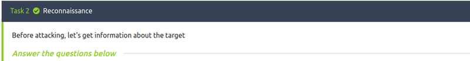
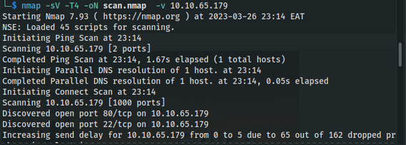
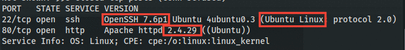

# TryHackMe Brute It Walkthrough.

The room's aim is to help beginners to practice their hash-cracking, bruteforcing, and privilege escalation capabilities. You'll find the CTF [here](https://tryhackme.com/room/bruteit). Let's get our practice on.

The first task after you deploy the machine is the **Reconnaissance**. This a very important part of any penetration test or CTF, the tools we'll be using in this task is nmap and dirb.

The **first** question asks for the number of open ports, we'll use nmap (Network mapper) to find out.

The command we'll use; `nmap -sV -oN scan.nmap -T4 -v [IP Address]`  

+ -sV => This tag gets the service versions
+ -oN => Saves the result in a file called scan.nmap in the normal format
+ -T4 => sets the timing template to 4
+ -v => makes the process verbose

After the nmap scan is finished, we can then answer the first 4 questions

1. How many ports are open? **2**
2. What version of SSH is running? **OpenSSH 7.6p1**
3. What version of Apache is running? **2.4.29**
4. Which Linux distribution is running? **Ubuntu**

The last question in the Recon task requires us to run **dirb** or **gobuster**. I prefer dirb so....

Command we'll use; `dirb http://[IP Address]`

The hidden directory we're intersted is the `/admin` 

When we go to the website `/admin` page, we find the following login page.

From here, we'll need to bruteforce the login page to get the credentials, we'll be using *hydra*.

In order to use hydra, we'll need a couple things to assemble the command.
+ The username/username wordlist
+ The password/ password wordlist
+ The address/hostname
+ The HTTP Method
+ The path to the login page
+ Request body for the username and password
+ Error message for incorrect logins

After inspecting the page, we find a comment with the username **admin**.

For the password list, we'll use *rockyou.txt* which can be found at */usr/share/wordlists/* path on kali linux and parrot OS.
The address is IP Address provided by tryhackme.
To get the HTTP method, we'll inspect the page and head to the *network* console. We'll try out the username with any password to see the request that will be sent. 

The path to the login page will be *[IP Address]/admin*

To get the request body, we'll 
