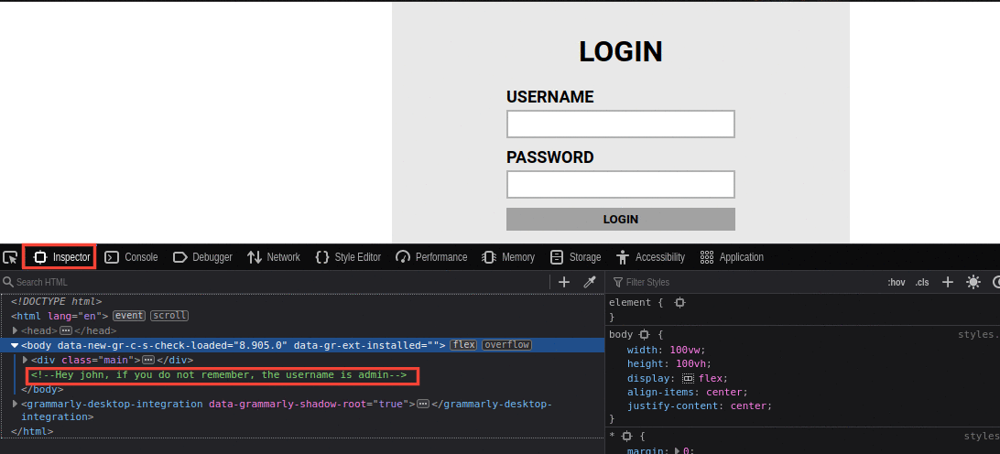

# TryHackMe Brute It Walkthrough.

The room's aim is to help beginners to practice their hash-cracking, bruteforcing, and privilege escalation capabilities. You'll find the CTF [here](https://tryhackme.com/room/bruteit). Let's get our practice on.

The first task after you deploy the machine is the **Reconnaissance**. This a very important part of any penetration test or CTF, the tools we'll be using in this task is nmap and dirb.

The **first** question asks for the number of open ports, we'll use nmap (Network mapper) to find out.

The command we'll use; `nmap -sV -oN scan.nmap -T4 -v [IP Address]`  

+ -sV => This tag gets the service versions
+ -oN => Saves the result in a file called scan.nmap in the normal format
+ -T4 => sets the timing template to 4
+ -v => makes the process verbose

After the nmap scan is finished, we can then answer the first 4 questions

1. How many ports are open? **2**
2. What version of SSH is running? **OpenSSH 7.6p1**
3. What version of Apache is running? **2.4.29**
4. Which Linux distribution is running? **Ubuntu**

The last question in the Recon task requires us to run **dirb** or **gobuster**. I prefer dirb so....

Command we'll use; `dirb http://[IP Address]`

The hidden directory we're intersted is the `/admin` 

When we go to the website `/admin` page, we find the following login page.

From here, we'll need to bruteforce the login page to get the credentials, we'll be using *hydra*.

In order to use hydra, we'll need a couple things to assemble the command.
+ The username/username wordlist
+ The password/ password wordlist
+ The address/hostname
+ The HTTP Method
+ The path to the login page
+ Request body for the username and password
+ Error message for incorrect logins

After inspecting the page, we find a comment with the username **admin**.

For the password list, we'll use *rockyou.txt* which can be found at */usr/share/wordlists/* path on kali linux and parrot OS.
The address is IP Address provided by tryhackme.
To get the HTTP method, we'll inspect the page and head to the *network* console. We'll try out the username with any password to see the request that will be sent. 

The path to the login page will be `*[IP Address]/admin*` 

To get the request body, we'll get the raw version of the post request. We'll then modify the request to; `user=admin&pass=^PASS^`. This will tell hydra to brute-force the password part only as we already have the username figured out.

To get the error message, copy the one we go when we tried the wrong password, *Username or password invalid*

The command we'll use will be combined to; `hydra -l admin -P /usr/share/wordlists/rockyou.txt http-post-form "/admin/:user=admin&pass=^PASS^:Username or password invalid" `

When we log in, we find the first flag and an rsa private key for a user called John.

We'll download this and try to ssh into the machine as *john*. After downloading, we'll have to change the permissions of the id_rsa file using `chmod 600 id_rsa`.

We quickly realise the private key has a passphrase. We'll use *john the ripper* to crack the passphrase.

Before we get to cracking, we have to convert into a suitable format using the *ssh2john* tool. The command to accomplish this will be; `ssh2john id_rsa > id_rsa.hash`.

After converting, we'll get *john* on it using the rockyou.txt wordlist; `john id_rsa.hash --wordlist=/usr/share/wordlists/rockyou.txt`

With the passphrase, we can the ssh using `ssh -i id_rsa john@[IP Address]`. 

We'll find the user.txt flag on john's homepage.

For the privilege escalation, will use `sudo -l` to see which tools/ commands john can run with root privilege.

From here, we'll head over to [gtfobin](https://gtfobins.github.io/gtfobins/cat/#sudo) to see how we can escalate our privileges using the *cat* command.

With cat, we can read files with root privilege, this will come in handy in reading the */etc/shadow/* file which has the password hashes for the users in the machine. 

We'll copy paste this file and the */etc/passwd* file to our terminal so that we can use *john the ripper* to crack it. In order to crack a shadow file using john, we need to unshadow it using the `unshadow password-file shadow-file > unshadowed-file` command.
After unshadowing it, we'll use the `john unshadowed-file --wordlist=/usr/share/wordlists/rockyou.txt` command

The root.txt file will then be found on the root home folder.

### Conclusion
I hope you had fun with the room, feel free to checkout my other article, follow me on twitter and connect on LinkedIn. Till next time.....
